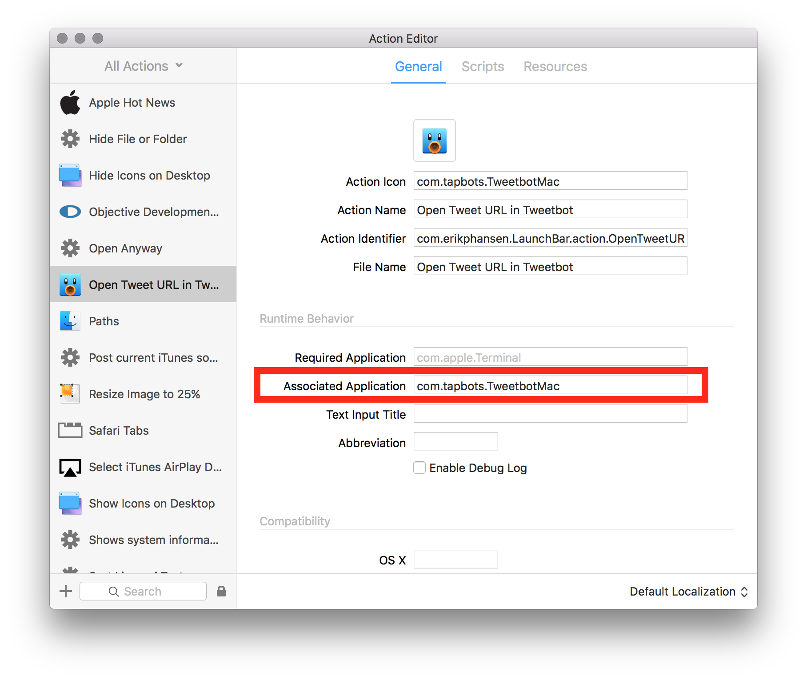

# Open Tweet URL in Tweetbot for Mac LaunchBar Action

This is a simple LaunchBar action that will take a URL to a specific tweet, such as <https://twitter.com/eirkeirkeirk/status/727207820827860993>, and open that tweet in [Tweetbot for Mac.](https://itunes.apple.com/us/app/tweetbot-for-twitter/id557168941?mt=12&at=10lpjW)

## Why in the world would I want this?

Maybe because you hate the Twitter website as much as I do. If you're like me, you are *never* logged into Twitter.com. But now you're looking at a tweet on Twitter.com and maybe you want to:

- retweet it
- reply to it
- favorite it
- follow the author
- do *anything at all* that would be easier and more pleasant using Tweetbot for Mac

I wrote a [blog post about](http://blog.erikphansen.com/open-tweet-links-in-tweetbot-with-launchbar/) the genesis of this action. It also serves as a *very* basic intro to making LaunchBar actions.

This is my first attempt at creating a custom LaunchBar action, so please point out all of the things that are sub-optimal!

## A new discovery

If you have this Action installed, you can just send a tweet URL directly to Tweetbot itself and it will open. The magic is in the `Runtime Behavior > Associated Application` field. Because it's set to `com.tapbots.TweetbotMac`, LaunchBar will pass the tweet URL on to this Action if you send the URL directly to Tweetbot. 🔥🔥🔥
